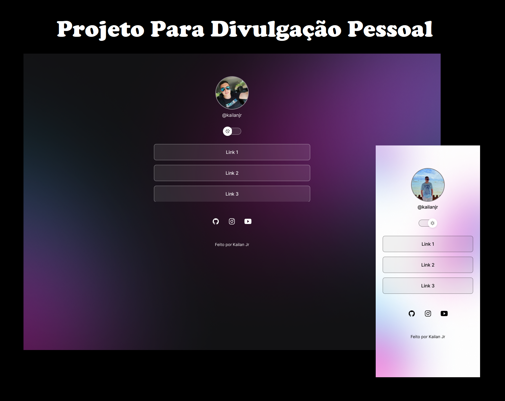

<h1 align="center"> CARTÃO DE VISITAS ONLINE </h1>

Projeto promovido com dicas da <a href="https://rocketseat.com.br/" target="_blank">Rocketseat</a> para ensino de tecnologias WEB. 

  <a href="#-tecnologias">Tecnologias</a>&nbsp;&nbsp;&nbsp;|&nbsp;&nbsp;&nbsp;
  <a href="#-projeto">Projeto</a>&nbsp;&nbsp;&nbsp;|&nbsp;&nbsp;&nbsp;
  <a href="#-layout">Layout</a>

 

  

## 🚀 Tecnologias

Esse projeto foi desenvolvido com as seguintes tecnologias:

- HTML e CSS
- JavaScript
- Git e Github
- Figma

## 💻 Projeto

Este projeto é agregador de links para usar como cartão de visitas online.

- [Acesse o projeto finalizado, online](https://kailanjr.github.io/devlinks/)

## 🔖 Layout

Você pode visualizar o layout do projeto através [DESSE LINK](https://www.figma.com/community/file/1187422022288947321). É necessário ter conta no [Figma](https://figma.com) para acessá-lo.
